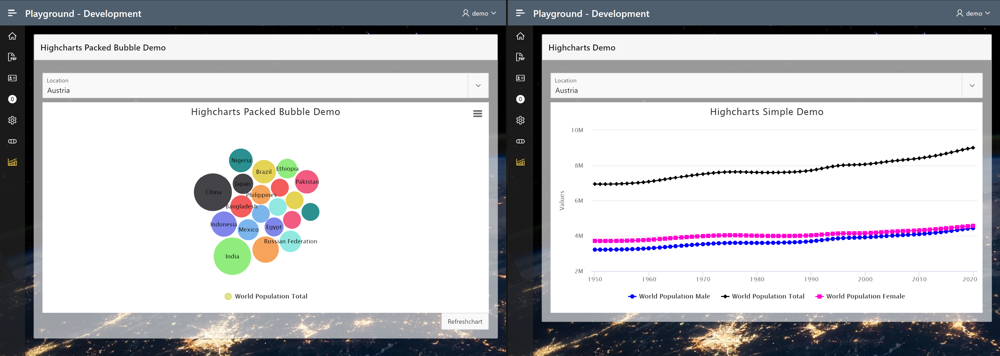

# APEX-Highcharts

This plug-in is used to add charts powered by Highcharts (https://www.highcharts.com/products/highcharts) to your application with as little affort as possible (for simple charts) but also support the full power of Highcharts for advanced projects.
* Please obtain a Highcharts license for your application when using this plugin in your application.
* Highcharts provides free licenses for personal or non-profit use

For a working demo click:  
https://apex.oracle.com/pls/apex/f?p=105972:1200  
Login is: demo / 12345678

If you like my stuff, donate me a coffee  

Credits:
*  Roal Hartman and his JET-PictoChart project on https://github.com/APEXGru/JET-PictoChart (used as base project)
*  Highcharts https://www.highcharts.com/
   * Please obtain a Highcharts license for your application when using this plugin in your application.
   * Highcharts provides free licenses for personal or non-profit use

Version:
*  V0.1 initial release

Currently the plugin supports following series types:
*  area
*  bar
*  bubble
*  column
*  heatmap
*  line
*  packedbubble
*  pie
*  scatter
*  spline
*  sunburst
*  timeline
*  wordcloud

Please proceed to the demo application for chart and configuration examples.
*  https://apex.oracle.com/pls/apex/f?p=105972:1200
*  Login is: demo / 12345678