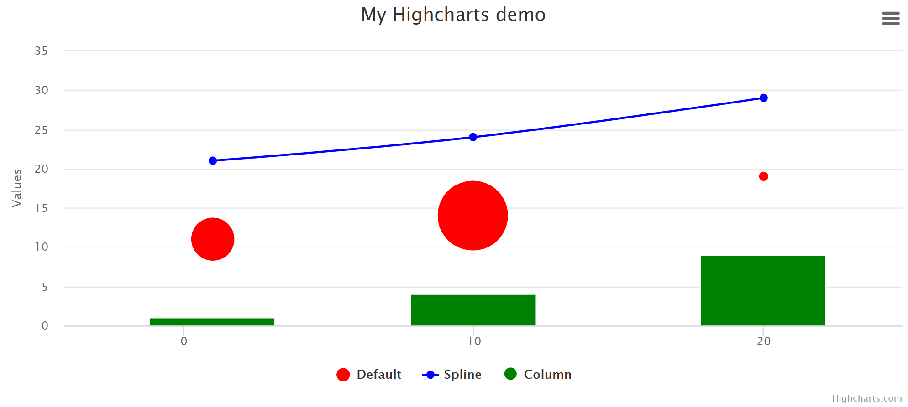

# APEX-Highcharts documentation

The APEX-Highcharts plugin persists of two APEX plugins.
* **Apex Highcharts** region plugin (parent region)
* **Apex Highcharts Serie** region plugin (sub region)

## **Apex Highcharts** region plugin (parent region)

The "APEX Highcharts region" plugin represents the container for the charts series.  
The configuration is applied to the chart option JSON object (see https://api.highcharts.com/highcharts/) in following sequence:
1. Attributes
2. SQL query
3. JavaScript Initialization Code


### Attributes
The chart region default configuration is done via attributes.
Following default attributes are available:
* **Highcharts licensed**: You should obtain your own license from highcharts shop (free for personal or non profit use) and set this option to yes otherwise a not license hint is displayed within the region
* **Title**: chart title (sets title.text https://api.highcharts.com/highcharts/title.text)
* **Display legend**: series legend (sets legend.enabled https://api.highcharts.com/highcharts/legend.enabled)
* **Allow exporting**: display export menu (hamburger menu in top right corner) (includes JavaScript library modules/exporting and sets exporting.enabled https://api.highcharts.com/highcharts/exporting.enabled)
* **Bacckground color**: chart background color (sets chart.backgroundColor https://api.highcharts.com/highcharts/chart.backgroundColor)
* **Zoom type**: allowed zoom axis are xy, x, y or none (sets chart.zoomType https://api.highcharts.com/highcharts/chart.zoomType)
* **Highcharts version**: default is "8.0", this should prevent change of behaviour when a new major version of highcharts is released or you can set to "Latest" to always use latest available version

### SQL Query

As defaul SQL query to change no chart options and prevent an error is ```select 0 "dummy" from dual;```.  
But you can also use a SQL query to set the chart options via SQL dynamic.

#### Examples:
This example will set the chart title and enables credits. The column names are needed in lowercase therefore it is necessary to quote the column alias with **"**.
XMLElement was used because Oralce 11g does not support JSON.
```
SELECT
      XMLElement("credits", XMLElement("enabled", 'true')) "credits",
      XMLElement("title", XMLElement("text", 'My Highchart Demo (dynamic)')) "title"
FROM
    dual
```

This example sets the chart title and enables shared tooltips.
```
SELECT 
    sys.xmltype('<title><text>Dynamic SQL chart demo</text></title>') "title",
    sys.xmltype('<tooltip><shared>true</shared></tooltip>') "tooltip"
FROM dual
```


### **JavaScript Initialization Code**
Has to be a function with one parameter that receives the chart option JSON object (see Highcharts API documentation https://api.highcharts.com/highcharts/). 

#### Examples:
##### Set zoom type, shared tooltip and x-axis crosshair:
```
function(option){
       option.chart.zoomType = "xy";
       option.tooltip.shared = true;
       option.xAxis = option.xAxis || {};
       option.xAxis.crosshair = { enabled: true };
}
```

##### Set tooltip and plotOptions
```
function(option){
    
    option.tooltip = {
        useHTML: true,
        pointFormat: '<b>{point.name}:</b> {point.value} ({point.rank})</sub>'
    };
    option.plotOptions = {
        packedbubble: {
            minSize: '50%',
            maxSize: '120%',
            zMin: 100000000,
            zMax: 2000000000,
            layoutAlgorithm: {
                splitSeries: false,
                gravitationalConstant: 0.02
            },
            dataLabels: {
                enabled: true,
                format: '{point.name}',
                filter: {
                    property: 'y',
                    operator: '>',
                    value: 100000000
                },
                style: {
                    color: 'black',
                    textOutline: 'none',
                    fontWeight: 'normal'
                }
            }
        }
    };
}
```


## **Apex Highcharts Serie** region plugin (sub region)

The plugin represents one or more serie objects of the chart serie array https://api.highcharts.com/highcharts/series.

The configuration is applied to the serie option JSON object (see https://api.highcharts.com/highcharts/series) in following sequence:
1. Region Title
2. Attributes
3. SQL query
4. JavaScript Initialization Code

### Region title
The region title is used as series title.

### Attributes
The serie region default configuration is done via attributes.
Following default attributes are available:
* **Serie type**: Currently the plugin supports following series types:
   *  area (https://www.highcharts.com/demo/area-basic)
   *  bar (https://www.highcharts.com/demo/bar-basic)
   *  bubble (https://www.highcharts.com/demo/bubble)
   *  column (https://www.highcharts.com/demo/column-basic)
   *  gauge (https://www.highcharts.com/demo/gauge-speedometer)
   *  heatmap (https://www.highcharts.com/demo/heatmap)
   *  line (https://www.highcharts.com/demo/line-basic)
   *  [packedbubble](packedbubble.md) (https://www.highcharts.com/demo/packed-bubble)
   *  pie (https://www.highcharts.com/demo/pie-basic)
   *  polygon (https://www.highcharts.com/demo/polygon)
   *  pyramid (https://www.highcharts.com/demo/pyramid)
   *  scatter (https://www.highcharts.com/demo/scatter)
   *  solidgauge (https://www.highcharts.com/demo/gauge-solid)
   *  [spline](spline.md) (https://www.highcharts.com/demo/dynamic-update)
   *  sunburst (https://www.highcharts.com/demo/sunburst)
   *  timeline (https://www.highcharts.com/demo/timeline)
   *  wordcloud (https://www.highcharts.com/demo/wordcloud)
* **Query type**: 
   * Data: the sql query only returns a array of serie data (for spline https://api.highcharts.com/highcharts/series.spline.data)
   * Full: the SQL query returns serie array (https://api.highcharts.com/highcharts/series)
* **Color**: serie color


### SQL query

#### Examples
A data (Query type) query for a spline (Serie type) serie returning data points with x and y coordinates.
```
select
    TIME "x",
    SUM(POPTOTAL)*1000 "y"
from
    population
where varid=2
and location = :P1200_LOCATION
and TIME <= extract(year from sysdate)
group by TIME
order by TIME
```

A data (Query type) query for a packedbubble (Serie type) serie returning data points with name, value and rank properties (rank is used for custom coloring) for top 20 population locations in current year.
```
select "name", "value", rank "rank"
from
(
select
    LOCATION "name",
    POPTOTAL*1000 "value",
    row_number() over (order by POPTOTAL desc) rank
from
    population
where varid=2
    and TIME = extract(year from sysdate)
    and locid < 900
)
where rank <= 20
```

A full (Query type) query returning multiple series.
When the query returns no serie "type" information the type configured in attributes is used.
```
select 
    series."name",
    series."color",
    series."type",
    series."index",
    cursor
    (
    select 
        1 "x", 1+series."c" "y", 100 "z", 'Point 1' "name"
    from dual
    union all
    select 
        10 "x", 4+series."c" "y", 300 "z", 'Point 2' "name"
    from dual
    union all
    select 
        20 "x", 9+series."c" "y", 10 "z", 'Point 3' "name"
    from dual
    ) "data"
from 
(
    select 'Default' "name", null "type", 'red' "color", 10 "c", 1 "index" from dual
    union all
    select 'Spline' "name", 'spline' "type", 'blue' "color", 20 "c", 2 "index" from dual
    union all
    select 'Column' "name", 'column' "type", 'green' "color", 0 "c", 3 "index" from dual
) series
```

