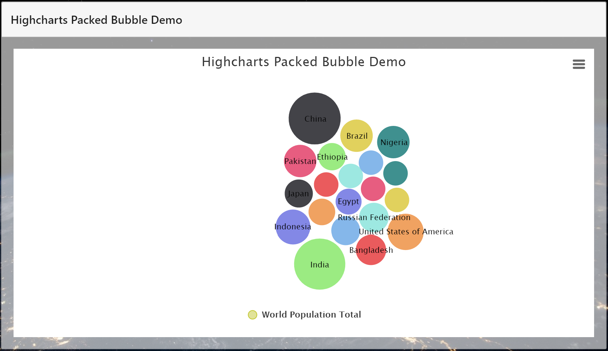
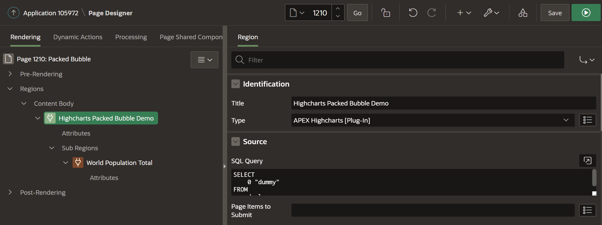
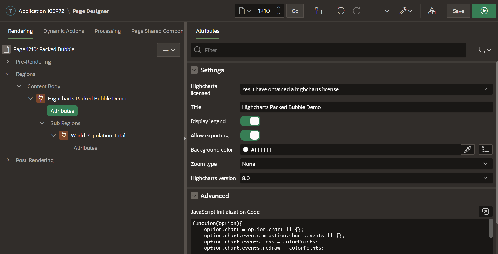
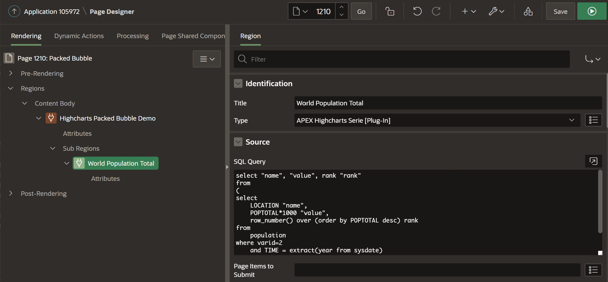

# APEX-Highcharts packedbubble



## 1. Add region of type "APEX Highcharts [Plug-In]"

Region properties:
* Title: Highcharts Packed Bubble Demo
* Type: APEX Highcharts [Plug-In]
* Source - SQL Query: ```SELECT 0 "dummy" FROM dual```




Region attributes:
* Title: Highcharts Packed Bubble Demo
* Display legend: Yes
* Allow exporting: Yes
* Background Color: #FFFFFF
* Zoom type: None
* Highcharts version: 8.0
* JavaScript Initialization Code: 
```
function(option){
    option.chart = option.chart || {};
    option.chart.events = option.chart.events || {};
    option.chart.events.load = colorPoints;
    option.chart.events.redraw = colorPoints;
    

    
    option.tooltip = {
        useHTML: true,
        pointFormat: '<b>{point.name}:</b> {point.value} ({point.rank})</sub>'
    };
    option.plotOptions = {
        packedbubble: {
            minSize: '50%',
            maxSize: '120%',
            zMin: 100000000,
            zMax: 2000000000,
            layoutAlgorithm: {
                splitSeries: false,
                gravitationalConstant: 0.02
            },
            dataLabels: {
                enabled: true,
                format: '{point.name}',
                filter: {
                    property: 'y',
                    operator: '>',
                    value: 100000000
                },
                style: {
                    color: 'black',
                    textOutline: 'none',
                    fontWeight: 'normal'
                }
            }
        }
    };
}
```




## 2. Add JavaScript Function on page
Following JavaScript code will fill the bubbles with different colors.
```
function colorPoints() {
    var series = this.series;
    for (var i = 0, ie = series.length; i < ie; ++i) {
        var points = series[i].data;
        for (var j = 0, je = points.length; j < je; ++j) {
            if (points[j].graphic) {
                points[j].graphic.element.style.fill = this.options.colors[points[j].rank % this.options.colors.length];
                points[j].graphic.element.style.stroke = this.options.colors[points[j].rank % this.options.colors.length];
            }
        }
    }
}
```

## 4. Add sub region of type "APEX Highcharts Serie [Plug-In]"

Region properties:
* Title: World Population Total
* Type: APEX Highcharts Serie [Plug-In]
* Source - SQL Query: 
```
select "name", "value", rank "rank"
from
(
select
    LOCATION "name",
    POPTOTAL*1000 "value",
    row_number() over (order by POPTOTAL desc) rank
from
    population
where varid=2
    and TIME = extract(year from sysdate)
    and locid < 900
)
where rank <= 20
```



Region attributes:
* Type: packedbubble
* Query type: Data
* Color: #C3C920

