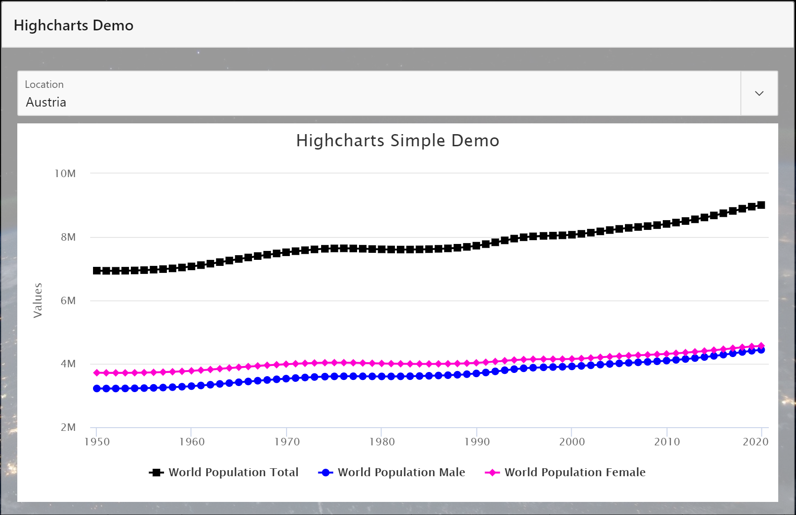
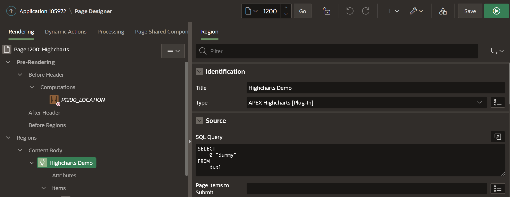
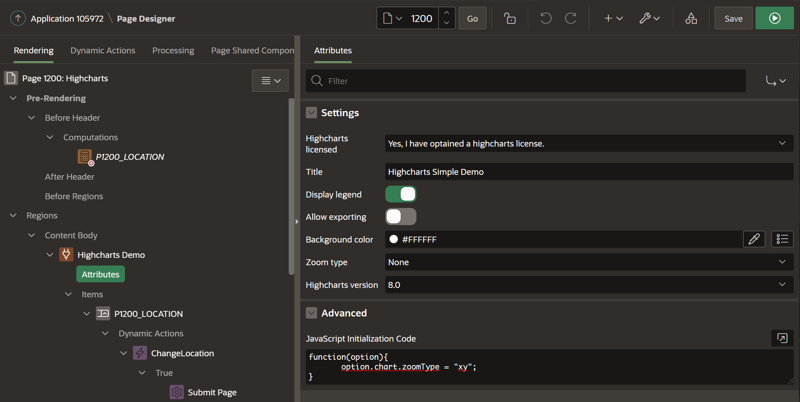
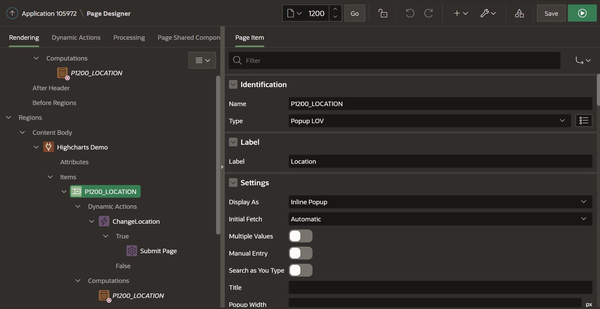
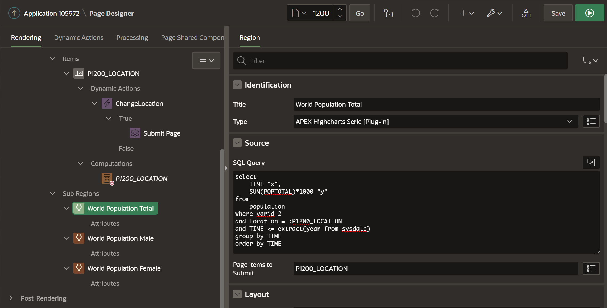
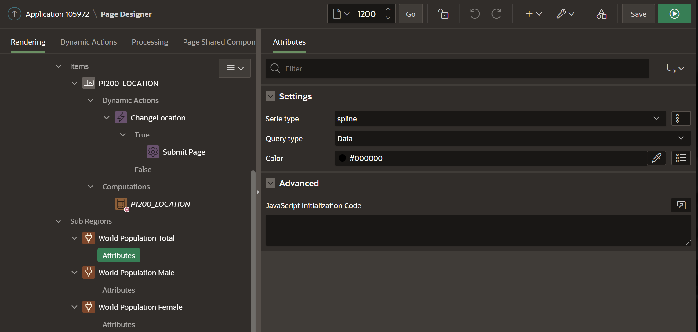

# APEX-Highcharts spline



## 1. Add region of type "APEX Highcharts [Plug-In]"

Region properties:
* Title: Highcharts Demo
* Type: APEX Highcharts [Plug-In]
* Source - SQL Query: ```SELECT 0 "dummy" FROM dual```




Region attributes:
* Title: Highcharts Simple Demo
* Display legend: Yes
* Allow exporting: No
* Background Color: #FFFFFF
* Zoom type: None
* Highcharts version: 8.0
* JavaScript Initialization Code: 
```
function(option){
       option.chart.zoomType = "xy";
}
```



## 2. Add item for filtering

* Add item "P1200_LOCATION" of type "POPUP LOV" with following "SQL Query": ```select LOCATION d, LOCATION v from population group by LOCATION order by LOCATION```
* Add a dynamic action for "Change" event and "Submit Page" action
* Add a computation ("Before Header") and set a default value via "PL/SQL Function Body" code: ```return 'Austria';```



## 3. Add sub region of type "APEX Highcharts Serie [Plug-In]"

Region properties:
* Title: World Population Total
* Type: APEX Highcharts Serie [Plug-In]
* Source - SQL Query: 
```
select
    TIME "x",
    SUM(POPTOTAL)*1000 "y"
from
    population
where varid=2
and location = :P1200_LOCATION
and TIME <= extract(year from sysdate)
group by TIME
order by TIME
```



Region attributes:
* Type: spline
* Query type: Data
* Color: #000000




## 4. Repeat step 3 for male and female serie

Male SQL query:
```
select
    TIME "x",
    SUM(POPMALE)*1000 "y"
from
    population
where varid=2
and location = :P1200_LOCATION
and TIME <= extract(year from sysdate)
group by TIME
order by TIME
```

Female SQL query:
```
select
    TIME "x",
    SUM(POPFEMALE)*1000 "y"
from
    population
where varid=2
and location = :P1200_LOCATION
and TIME <= extract(year from sysdate)
group by TIME
order by TIME
```
